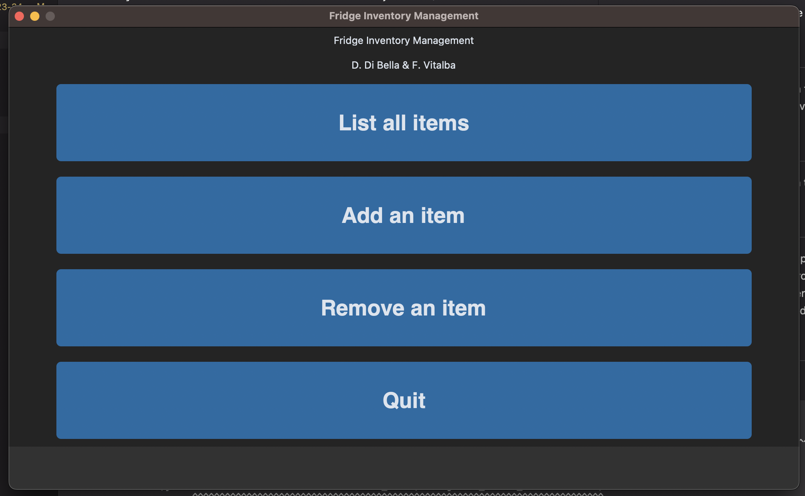
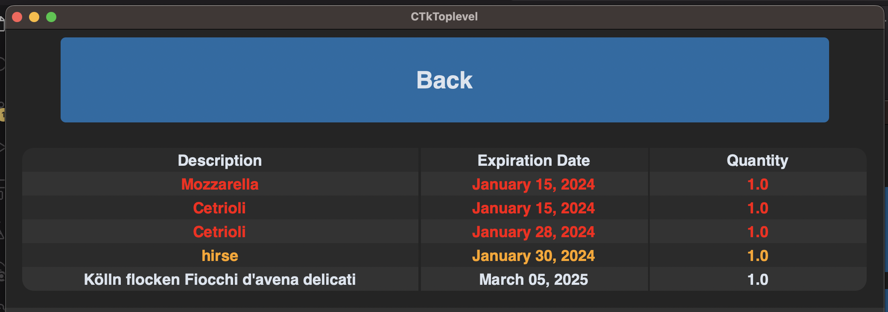
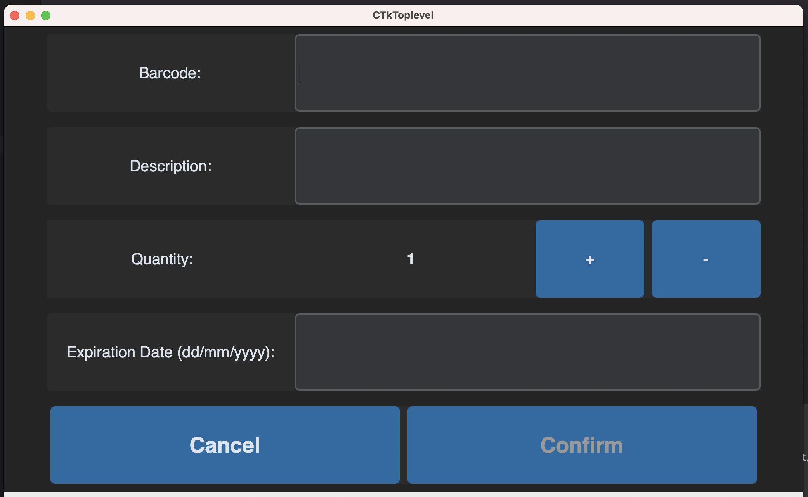
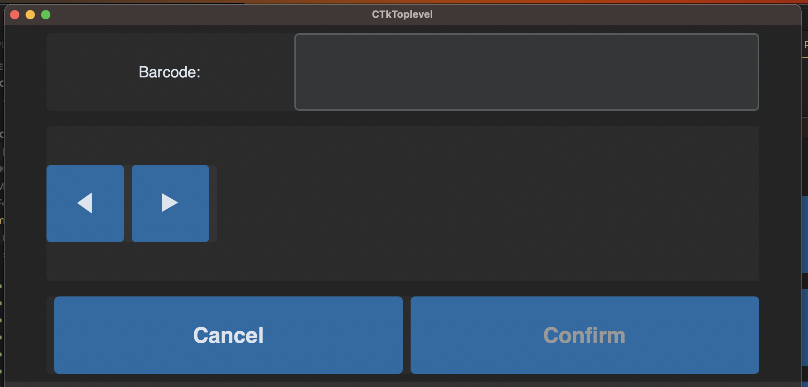

# Fridge Inventory Management
## Maker Lab Project 2023/24
Project for the Maker Lab Course of unibz of the year 2023/24.

# Description
This Project aims to reduce the amount of food wasted in households. More often than not, people simply forget what's inside their fridge and what expiration dates these items hold. Using our project we aim to reduce the amount of forgotten food, by simply providing the user with the necessary information.

# Set-up
Create a file `/src/env.py` with two variables named `adafruit_user` and `adafruit_key` and assign the values in order to connect to the adafruit.io services.

# Usage
This project is optimized to be run on a Raspberry Pi, in fullscreen mode (1024x600) on a Touch Screen Display (of at least 7" Diameter). In order to use all features, the usage of a USB 2D Barcode-Scanner is highly recommended.

# Preview
Here are some screenshots from the App:
#### Main Menu

#### Item List

#### Add Item

#### Remove Item

# Credits
* We're using the free and open API from https://world.openfoodfacts.org/data which allows us to retrieve the product description from it's barcode.
* We're using an adapted version of [CTKTable](https://github.com/Akascape/CTkTable/tree/main). The adaption is the introduction of formatted row colors based on dataset.

# Authors
* Daniel Di Bella
* Fabio Vitalba
