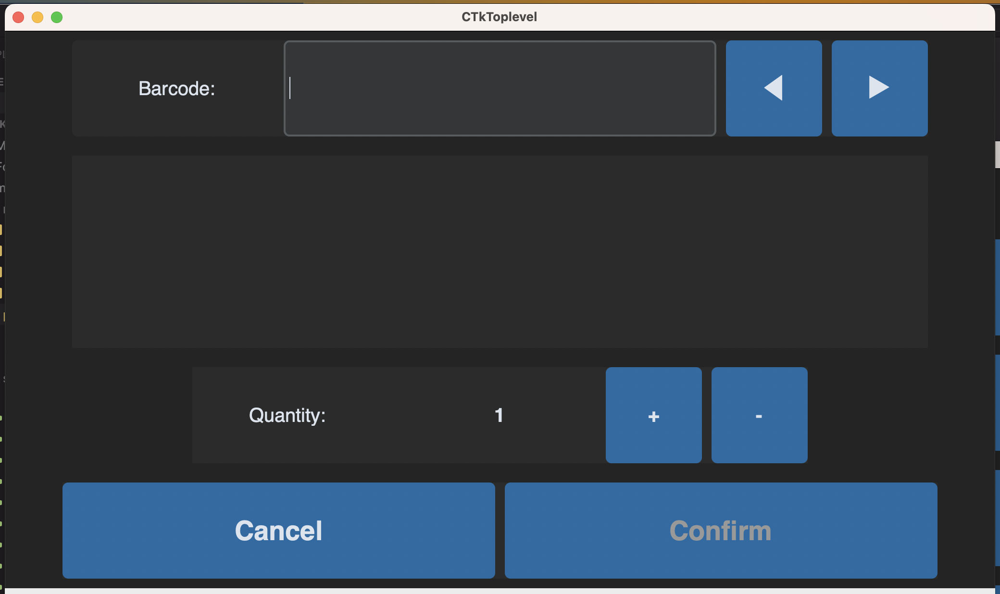

# Fridge Inventory Management
## Maker Lab Project 2023/24
Project for the Maker Lab Course of unibz of the year 2023/24.

# Description
This Project aims to reduce the amount of food wasted in households. More often than not, people simply forget what's inside their fridge and what expiration dates these items hold. Using our project we aim to reduce the amount of forgotten food, by simply providing the user with the necessary information.

# Set-up
Create a file `/src/env.py` with two variables named `adafruit_user` and `adafruit_key` and assign the values in order to connect to the adafruit.io services.

# Usage
This project is optimized to be run on a Raspberry Pi, in fullscreen mode (1024x600) on a Touch Screen Display (of at least 7" Diameter). In order to use all features, the usage of a USB 1D Barcode-Scanner is highly recommended.

# Preview
Here are some screenshots from the App:
#### Main Menu

#### Item List

#### Add Item

#### Remove Item

# Code Description
Our Project uses the `tkinter` and `customtkinter` packages to create a GUI for our Touchscreen Display. On macOS and RaspberryOS the windows are displayed on top of eachother, while on Windows they are incorrectly displayed behind the previously active window.
**The entrance point of our app is the `gui_app.py`-file.**

## `adafruit_connector_test.py`
This file serves as a test suite for the functions defined in `adafruit_connector.py`.
## `adafruit_connector.py`
This file contains functions that we use to connect to the adafruit IO cloud. We use adafruit in order to read, add, or remove items in the cloud.
## `add_item_window.py`
This file contains the function that builds the "Add item" View and displays it on top of the "Main Menu" view. This View allows the user to add items to their inventory. Most user-inputs are done through an USB-Barcode Scanner which always sends the read text including a "NewLine" at the end. We use this behaviour to automatically skip to the next input field or to read **custom** barcodes in order to increment/decrement the expiration date. The Description is fetched from the `openfoodfacts` API, if none is found, the User has to write a Description using the Keyboard. The Quantity has a default value of 1 and can be modified using the touch screen. The Expiration Date has a default value of **Today** and can be modified using **custom** Barcodes to increment/decrement the date by Days, Weeks or Months.
## `const.py`
This file contains a set of constant values which we use throughout our application.
## `custom_ctktable.py`
This file is a slighly adapted version from the [CTKTable](https://github.com/Akascape/CTkTable/tree/main) package. Since `CTKTable` does not provide a functionality to individually color rows, we implemented a custom part of it. The adapted part can be found using the `##### CUSTOM` searchterm.
## `expiration_date.py`
This file is a helper to the "Add Item" View. The `handle_exp_date_input`-method handles the addition or subtraction of the Expiration Date based on the read Barcode. For example `+1W` adds a week to the current Expiration Date.
## `gui_app.py`
This is the **Entrance Point** of our application. It draws a "Main Menu" View which remains open at all times. Once the user selects an option, a new View is drawn on top of the "Main Menu".
The Application starts by reading all Items from adafruit IO cloud. This list is passed on to all the Views.

_(Note, that on Windows the new View is not drawn on top and must be selected individually.)_
## `item_list_window.py`
This file contains the function that builds the "Item List" View and displays it on top of the "Main Menu" view. It displays all items the user has in their inventory. Using the `custom_ctktable.py` we visualize the items, sorted by expiration date. Already expired items are colored red, items that are about to expire are colored orange and other items have no particular coloring.
## `item.py`
This file abstracts the `openfoodfacts_connector.py`-methods. We use this because we might implement other ways to retrieve an item's description from a scanned barcode.
## `openfoodfacts_connector_test.py`
This file serves as a test suite for the functions defined in `openfoodfacts_connector.py`.
## `openfoodfacts_connector.py`
This file contains functions that we use to connect to the openfoodfacts API. We use openfoodfacts in order to retrieve an item description from a barcode.
## `remove_item_window.py`
This file contains the function that builds the "Remove item" View and displays it on top of the "Main Menu" view. It allows the user to remove a selected Item from their inventory. Input is either done through a scanned barcode, or by iterating all Items using the arrow buttons.

# Credits
* We're using the free and open API from https://world.openfoodfacts.org/data which allows us to retrieve the product description from it's barcode.
* We're using the package [customtkinter](https://github.com/TomSchimansky/CustomTkinter). This is a nicer version of the default `tkinter` package, but offers the same functionality.
* We're using an adapted version of [CTKTable](https://github.com/Akascape/CTkTable/tree/main). The adaption is the introduction of formatted row colors based on dataset.

# Authors
* Daniel Di Bella
* Fabio Vitalba
